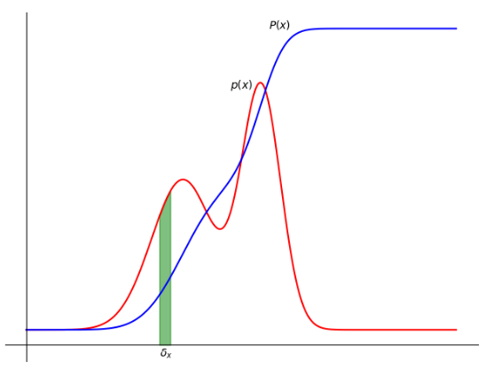

# Pattern Recognition and Machine Learning
Implementing algorithms described in the book "Pattern Recognition and Machine Learning"

## Required Package
- python 3
- numpy
- matplotlib 
- sklearn 

## Figures 

- **ch1. Introduction**
    - **Figure 1.2**: Plot of a training data set of N =10 points, shown as blue circles, each comprising an observation of 
    the input variable x along with the corresponding target variable t. The green curve shows the function sin(2πx) 
    used to generate the data. Our goal is to predict the value of t for some new value of x, without knowledge of 
    the green curve
    
        
     
    - **Figure 1.4**: Plots of polynomials having various orders M, shown as red curves, fitted to the data set shown in
    Figure 1.2
    
        
        
    - **Figure 1.5**: Graphs of the root-mean-square error, defined by (1.3), evaluated
    on the training set and on an independent test set for various values of M.
        
        
     
    - **Table 1.1**: Table of the coefficients w* for polynomials of various order.Observe how the typical magnitude of 
    the coefficients increases dramatically as the order of the polynomial increases.
    
        
    
    - **Figure 1.6**: Plots of the solutions obtained by minimizing the sum-of-squares error function using the M = 9
    polynomial for N = 15 data points (left plot) and N = 100 data points (right plot). We see that increasing the
    size of the data set reduces the over-fitting problem.
        
        
    - **Figure 1.7**: Plots of M = 9 polynomials fitted to the data set shown in Figure 1.2 using the regularized error
    function (1.4) for two values of the regularization parameter λ corresponding to ln λ = −18 and ln λ = 0. The
    case of no regularizer, i.e., λ = 0, corresponding to ln λ = −∞, is shown at the bottom right of Figure 1.4.
    
        
    
    - **Figure 1.8**: Graph of the root-mean-square error (1.3) versus ln λ for the M = 9
    polynomial.
    
        
    
    - **Figure 1.12**: The concept of probability for discrete variables can be extended to that of a probability
    density p(x) over a continuous variable x and is such that the probability of x lying in the interval (x, x+δx) is 
    given by p(x)δx for δx → 0. The probability density can be expressed as the
    derivative of a cumulative distribution function P(x)
    
        

    - **Figure 1.14**: Illustration of the likelihood function for a Gaussian distribution, shown by the
    red curve. Here the black points denote a data set of values {xn}, and
    the likelihood function given by (1.53) corresponds to the product of the blue values. Maximizing the likelihood 
    involves adjusting the mean and variance of the Gaussian so as to maximize this product.
    
        
        
     - **Figure 1.16**: Schematic illustration of a Gaussian conditional distribution for t given x given by
    (1.60), in which the mean is given by the polynomial function y(x, w), and the precision is given
    by the parameter β, which is related to the variance by β−1 = σ2.
    
        
     
## Refrerences
Christopher Bishop. (2007). Pattern Recognition and Machine Learning (Information Science and Statistics). Springer